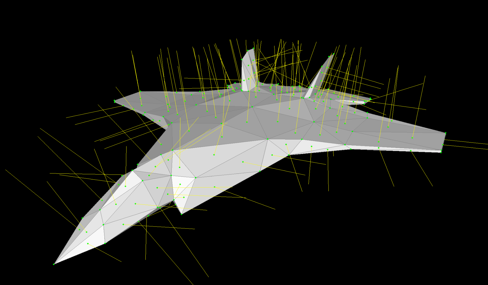
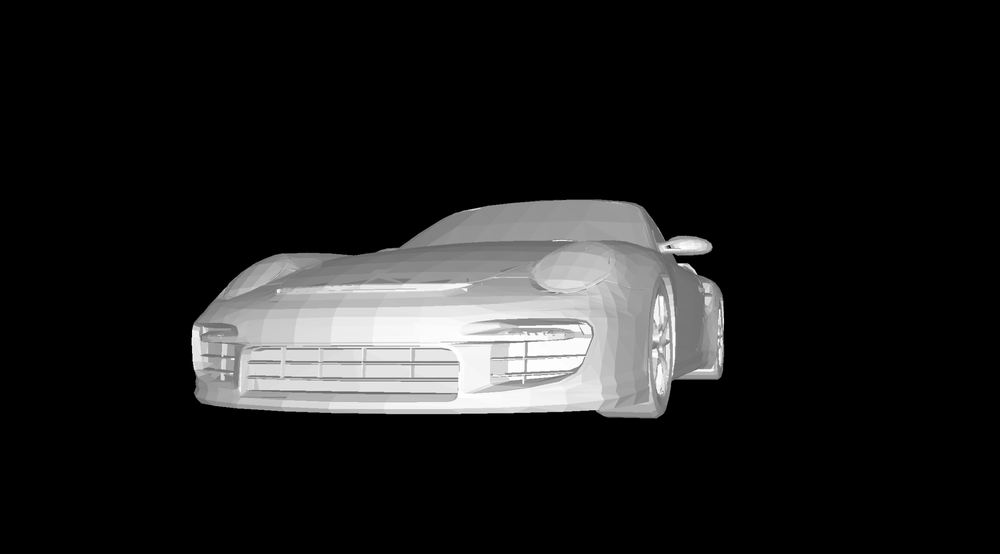

# 3d-Viewer

This is a basic wireframe renderer written in python / Pygame and ported to the web using pygbag.

## Web Demo:
https://sebi364.github.io/wireframe-renderer/
## Controls:
- Move Camera : `W`, `A`, `S`, `D`, `E`, `Q`
- Rotate Modell : `Up`, `Down`, `Left`, `Right`, `PegUp`, `PgDn`
- Toggle Settings
  - Toggle Polygons = `C`
  - Toggle Wireframe = `V`
  - Toggle Vertices = `B`
  - Toggle Normals = `N`
  - Toggle Hidden Polygons = `M`
- Load different Models
  - `1` = Cube
  - `2` = Monkey
  - `3` = Plane
  - `4` = Porsche
